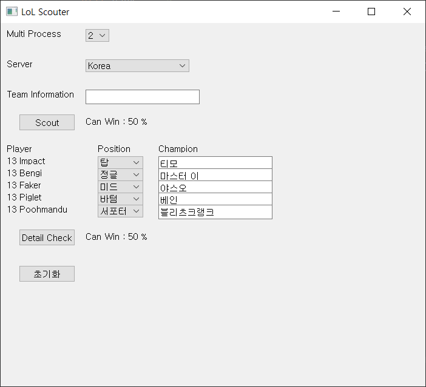
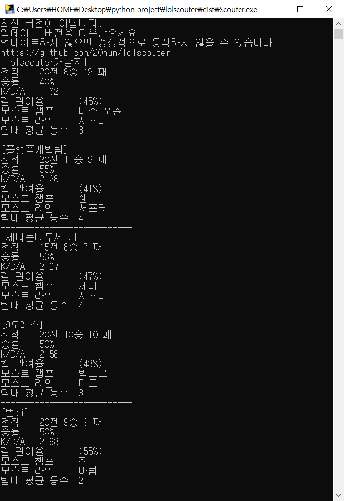
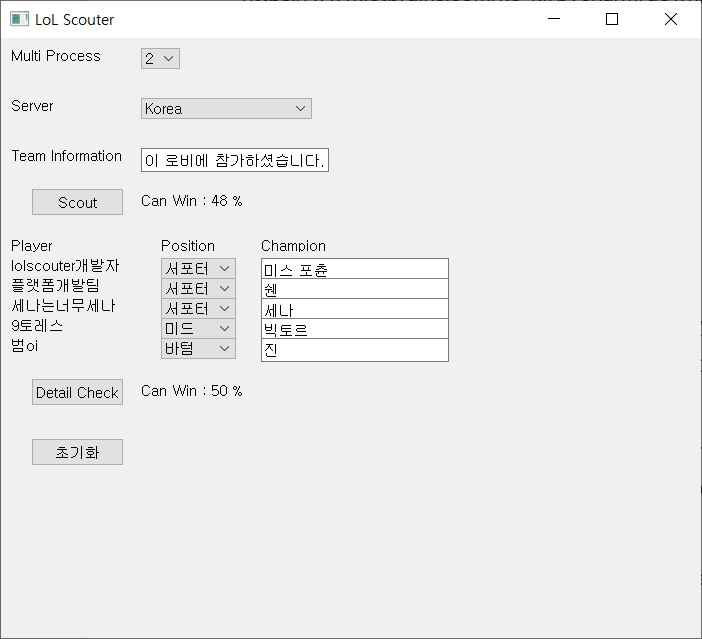
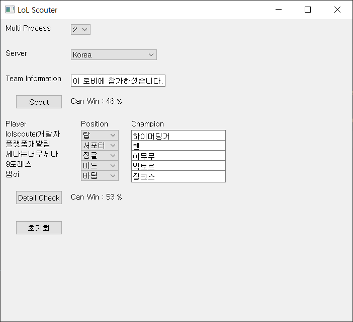

# LoL Scouter 

## Overview
리그 오브 레전드 솔로 랭크에서, 팀원들의 정보를 op.gg 사이트에서 크롤링 후 분석을 통해 이길 확률을 계산하는 자동화 프로그램

## Version
1.0.0

[download](https://github.com/20hun/lolscouter/blob/main/Scouter.exe)

## Library
1. PyQt - GUI 프로그래밍
2. Selenium - 웹 사이트 조작 & 크롤링
3. BeautifulSoup - 웹 크롤링
4. Pandas - 크롤링 데이터 DataFrame 2차원 배열 변환

## Tutorial


Multi Process - 선택한 개수 만큼 op.gg 사이트에서 동시에 크롤링 [default = cpu core / 2]  
> 높은 값으로 설정 시 그만큼 동작 시간이 단축되지만, cpu 부족으로 인해 정상적으로 동작하지 않을 수 있음, 게임이 켜져 있는 상태를 감안하여 default 세팅 값을 추천

Server - 모든 글로벌 서버를 선택할 수 있지만, 현재는 한국 서버 및 한국어만 지원

Team Information - 게임이 잡히면 채팅창에 아래와 같은 접속 정보 드래그하여 ctrl c & v
```
sampleID1님이 로비에 참가하셨습니다.
sampleID2님이 로비에 참가하셨습니다.
sampleID3님이 로비에 참가하셨습니다.
sampleID4님이 로비에 참가하셨습니다.
sampleID5님이 로비에 참가하셨습니다.
```

### Scout
[Scout] 버튼 클릭 후 약 1 ~ 2분 기다리면 아래와 같은 정보 표시  
cmd 화면 - id 별 op.gg 데이터로 분석한 상세 정보 표시  
main 화면 - 이길 확률 확인 및 Detail Check 를 위한 자동 세팅 [주력 라인 & 챔프]




### Detail Check
실제 팀원들의 라인과 챔프를 수동으로 세팅하고 [Detail Check] 클릭 시 이길 확률 표시



### 이길 확률 알고리즘
Scout - 각 팀원의 승률 + 가산점 / 5
* id 조회 안될 경우 default 50점
```
팀내 평균 등수 - 1: +20, 2: +10, 4: -10, 5: -20
킬 관여율 - 60% 이상: +10, 60 ~ 50: +5, 40 ~ 30: -5, 30% 미만: -10
kda - 4 이상: +10, 4 ~ 3: +5, 2 ~ 1: -5, 1 미만: -10
```
Detail Check - Scout 합산 결과 + 가산점 / 5
```
주력 챔프 +5%
주력 라인 +5%
```

### exe 파일 추출
> 본인의 취향에 맞게 코드 및 이길 확률 알고리즘 수정하여 활용 가능  
pyinstaller 라이브러리 다운로드하여 makeExe.py 실행

If you have any questions please contact me lyhgod@gmail.com